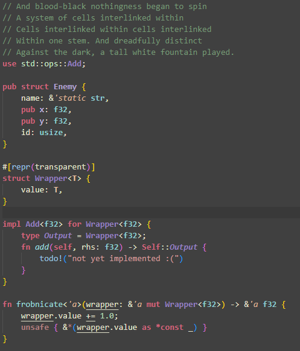
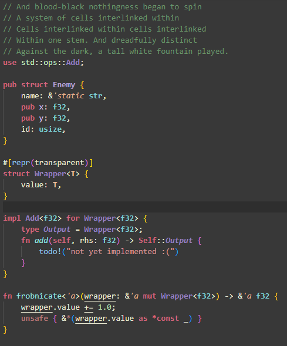
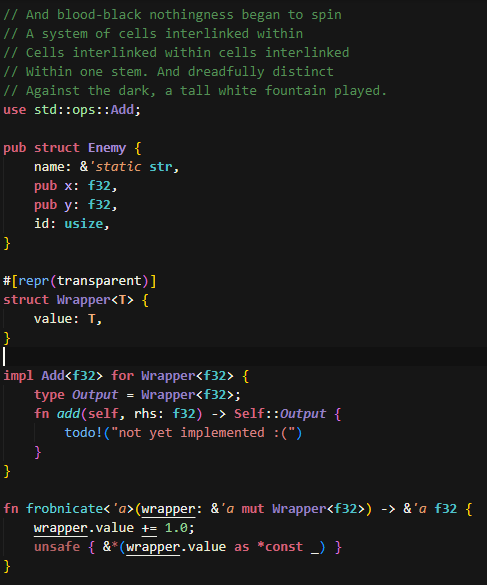
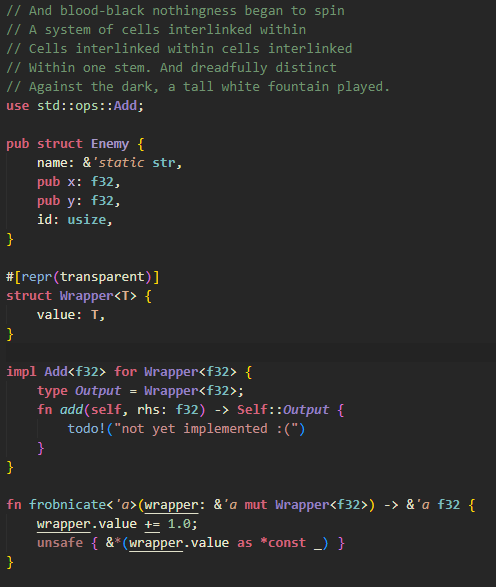

# Warmer Pale Fire

A modified version of matklad's [Pale Fire](https://github.com/matklad/pale-fire) Vs Code theme, originally based on [emacs-zenburn](https://github.com/bbatsov/zenburn-emacs).

Regular:

High Contrast:

Darker:

Stealth:

## How to install

(Currently unavailable in the Vs Code extension marketplace)

Prerequisites:

- Have [Rust](https://www.rust-lang.org/) installed
- Have [nodejs and npm](https://docs.npmjs.com/downloading-and-installing-node-js-and-npm) installed

Installation guide:

1. Clone this repository
2. In the project root directory \[`~/.../warmer-pale-fire`\], run `cargo run` in the terminal
   - This should generate a `themes` folder in the project root directory, containing json files specifying the Vs Code themes
3. Run `npm install` in the terminal (if you haven't done so already)
   - This should only need to be done once for this project
4. Run `npm run package` in the terminal
   - This should generate a .vsix file, named `warmer-pale-fire-X.X.X.vsix` (where X.X.X is the project's version)
5. Run `code --install-extension warmer-pale-fire-X.X.X.vsix` to add the extension to Vs Code
6. The themes should now be added to Vs Code, and can be selected under color themes

## License

Licensed under GPL3, as with [Pale Fire](https://github.com/matklad/pale-fire) and [emacs-zenburn](https://github.com/bbatsov/zenburn-emacs).
